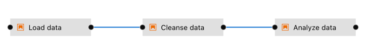

<!--

Copyright 2018-2023 Elyra Authors

Licensed under the Apache License, Version 2.0 (the "License");
you may not use this file except in compliance with the License.
You may obtain a copy of the License at

http://www.apache.org/licenses/LICENSE-2.0

Unless required by applicable law or agreed to in writing, software
distributed under the License is distributed on an "AS IS" BASIS,
WITHOUT WARRANTIES OR CONDITIONS OF ANY KIND, either express or implied.
See the License for the specific language governing permissions and
limitations under the License.

-->
## Getting started with generic pipelines

A [pipeline](https://elyra.readthedocs.io/en/latest/user_guide/pipelines.html) comprises one or more nodes that are (in many cases) connected with each other to define execution dependencies. Each node is implemented by a [component](https://elyra.readthedocs.io/en/latest/user_guide/pipeline-components.html) and typically performs only a single task, such as loading data, processing data, training a model, or sending an email.
管道由一个或多个节点组成，这些节点（在许多情况下）相互连接以定义执行依赖性。每个节点由一个组件实现，通常仅执行一项任务，例如加载数据、处理数据、训练模型或发送电子邮件。



A _generic pipeline_ comprises nodes that are implemented using _generic components_. In the current release Elyra includes generic components that run Jupyter notebooks, Python scripts, and R scripts. Generic components have in common that they are supported in every Elyra pipelines runtime environment: local/JupyterLab, Kubeflow Pipelines, and Apache Airflow.
通用管道包含使用通用组件实现的节点。在当前版本中，Elyra 包含运行 Jupyter 笔记本、Python 脚本和 R 脚本的通用组件。通用组件的共同点是它们在每个 Elyra pipelines 运行时环境中都受支持：local/JupyterLab、Kubeflow Pipelines 和 Apache Airflow。


In this introductory tutorial you will learn how to create a generic pipeline and run it in your local JupyterLab environment.
在本介绍性教程中，您将学习如何创建通用管道并在本地 JupyterLab 环境中运行它。


When you run a pipeline in your local environment, each Jupyter notebook or script is executed in a Kernel on the machine where JupyterLab is running, such as your laptop. Since resources on that machine might be limited local pipeline execution might not always be a viable option.
当您在本地环境中运行管道时，每个 Jupyter 笔记本或脚本都会在运行 JupyterLab 的计算机（例如您的笔记本电脑）上的内核中执行。由于该计算机上的资源可能有限，因此本地管道执行可能并不总是可行的选择。

The [Run generic pipelines on Kubeflow Pipelines tutorial](https://github.com/elyra-ai/examples/tree/main/pipelines/run-generic-pipelines-on-kubeflow-pipelines) and [Run generic pipelines on Apache Airflow tutorial](https://github.com/elyra-ai/examples/tree/main/pipelines/run-generic-pipelines-on-apache-airflow) are similar to this tutorial but run the pipeline on Kubeflow Pipelines or Apache Airflow, enabling you to take advantage of shared compute resources in the cloud that might dramatically reduce pipeline processing time or allow for processing of much larger data volumes.
在 Kubeflow Pipelines 上运行通用管道教程和在 Apache Airflow 上运行通用管道教程与本教程类似，但在 Kubeflow Pipelines 或 Apache Airflow 上运行管道，使您能够利用云中的共享计算资源，这可能会大大减少管道处理时间或允许处理更大的数据量。

### Prerequisites

- [JupyterLab 3.x with the Elyra extension v3.x (or newer) installed](https://elyra.readthedocs.io/en/latest/getting_started/installation.html).

> The tutorial instructions were last updated using Elyra version 3.0.
> 本教程说明最后使用 Elyra 版本 3.0 进行更新。

### Setup

This tutorial uses the `introduction to generic pipelines` sample from the https://github.com/elyra-ai/examples GitHub repository.

1. Launch JupyterLab.

   > **Note**: When you start JupyterLab using the `jupyter lab` command, it loads the contents of the current working directory.
   > 注意：当您使用 jupyter lab 命令启动 JupyterLab 时，它会加载当前工作目录的内容。

   > For example, we recommend starting JupyterLab from a new directory on your system that is not an existing git repository. This will make sure you can clone the repository as mentioned in the next step.
   > 例如，我们建议从系统上不是现有 git 存储库的新目录启动 JupyterLab。这将确保您可以按照下一步所述克隆存储库。

2. Open the _Git clone_ wizard (Git > Clone A Repository).

3. Enter `https://github.com/elyra-ai/examples.git` as _Clone URI_.

4. In the _File Browser_ navigate to `examples/pipelines/introduction-to-generic-pipelines`.

   

   The cloned repository includes a set of files that download an open [weather data set from the Data Asset Exchange](https://developer.ibm.com/exchanges/data/all/jfk-weather-data/), cleanse the data, analyze the data, and perform time-series predictions.
   克隆的存储库包括一组文件，这些文件从数据资产交换下载开放的天气数据集、清理数据、分析数据并执行时间序列预测。

You are ready to start the tutorial.

### Create a generic pipeline

1. Open the _Launcher_ (File > New Launcher) if it is not already open.

   

2. Open the _Generic Pipeline Editor_ to create a new untitled generic pipeline.

   

3. In the JupyterLab _File Browser_ panel, right click on the untitled pipeline, and select &#x270E; _Rename_.

   

4. Change the pipeline name to `hello-generic-world`.

   To help others understand the purpose of the pipeline you should add a description.
   为了帮助其他人理解管道的用途，您应该添加描述。

5. In the Visual Pipeline Editor open the properties panel on the right side.

   

6. Select the _Pipeline properties_ tab and enter a pipeline description.

   

7. Close the properties panel.

Next, you'll add a file to the pipeline that downloads an open data set archive from public cloud storage.
接下来，您将向管道添加一个文件，该管道从公共云存储下载开放数据集存档。

### Add a notebook or script to the pipeline

This tutorial includes a Jupyter notebook `load_data.ipynb` and a Python script `load_data.py` that perform the same data loading task.

> For illustrative purposes the instructions use the notebook, but feel free to use the Python script. (The key takeaway is that you can mix and match notebooks and scripts, as desired.)
> 出于说明目的，说明使用笔记本，但也可以随意使用 Python 脚本。 （关键要点是您可以根据需要混合搭配笔记本和脚本。）

To add a notebook or script to the pipeline:

1. Expand the component palette panel on the left hand side. Note that there are multiple component entries, one for each supported file type.
   展开左侧的组件选项板面板。请注意，有多个组件条目，每个条目对应一种受支持的文件类型。

   

2. Drag the _notebook_ component entry onto the canvas (or double click on a palette entry) and hover over the node. The error messages are indicating that the node is not yet configured properly.
   将笔记本组件条目拖到画布上（或双击调色板条目）并将鼠标悬停在节点上。错误消息表明该节点尚未正确配置。

   

3. Select the newly added node on the canvas, right click, and select _Open Properties_ from the context menu.
   在画布上选择新添加的节点，单击鼠标右键，然后从上下文菜单中选择“打开属性”。

   

4. Configure the node properties.

   

   Some properties are only required when you plan to run the pipeline in a remote environment, such as Kubeflow Pipelines. However, it is considered good practice to always specify those properties to allow for easy migration from development (where you might run a pipeline locally) to test and production (where you would want to take advantage of resources that are not available to you in a local environment). Details are in the instructions below.
   仅当您计划在远程环境中运行管道（例如 Kubeflow Pipelines）时，才需要某些属性。但是，始终指定这些属性被认为是一种很好的做法，以便可以轻松地从开发（您可以在本地运行管道）迁移到测试和生产（您希望利用在环境中无法使用的资源）。当地环境）。详细信息请参阅下面的说明。

5. Assign the node a descriptive label. If you leave the label empty, the file name (e.g. `load_data.ipynb`) will be used.
   为节点分配一个描述性标签。如果将标签留空，则将使用文件名（例如 load_data.ipynb ）。

   

6. Browse to the file location. Navigate to the `introduction-to-generic-pipelines` directory and select `load_data.ipynb`.
   浏览到文件位置。导航到 introduction-to-generic-pipelines 目录并选择 load_data.ipynb 。

   

7. As _Runtime Image_ choose `Pandas`. The runtime image identifies the container image that is used to execute the notebook or Python script when the pipeline is run on Kubeflow Pipelines or Apache Airflow. This setting must always be specified but is ignored when you run the pipeline locally.
   作为运行时图像，选择 Pandas 。运行时映像标识当管道在 Kubeflow Pipelines 或 Apache Airflow 上运行时用于执行笔记本或 Python 脚本的容器映像。必须始终指定此设置，但在本地运行管道时将被忽略。

   

   If the container requires a specific minimum amount of resources during execution, you can specify them.
   如果容器在执行期间需要特定的最小资源量，您可以指定它们。

   

   > If no custom requirements are defined, the defaults in the target runtime environment (Kubeflow Pipelines or Apache Airflow) are used.
   > 如果未定义自定义要求，则使用目标运行时环境（Kubeflow Pipelines 或 Apache Airflow）中的默认值。

   If a notebook or script requires access to local files, such as Python scripts, you can specify them as _File Dependencies_. When you run a pipeline locally this setting is ignored because the notebook or script can access all (readable) files in your workspace. However, it is considered good practice to explicitly declare file dependencies to make the pipeline also runnable in environments where notebooks or scripts are executed isolated from each other.
   如果笔记本或脚本需要访问本地文件（例如 Python 脚本），您可以将它们指定为文件依赖项。当您在本地运行管道时，此设置将被忽略，因为笔记本或脚本可以访问工作区中的所有（可读）文件。但是，显式声明文件依赖项以使管道也可以在笔记本或脚本彼此隔离执行的环境中运行被认为是一种很好的做法。

8. The `load_data` file does not have any input file dependencies. Leave the input field empty.
   load_data 文件没有任何输入文件依赖项。将输入字段留空。

   

   If desired, you can customize additional inputs by defining environment variables.
   如果需要，您可以通过定义环境变量来自定义其他输入。

9. Click _refresh_ to scan the file for environment variable references. Refer to the [best practices for file-based pipeline nodes](https://elyra.readthedocs.io/en/latest/user_guide/best-practices-file-based-nodes.html#environment-variables) to learn more about how Elyra discovers environment variables in notebooks and scripts.
   单击刷新以扫描文件以获取环境变量引用。请参阅基于文件的管道节点的最佳实践，详细了解 Elyra 如何发现笔记本和脚本中的环境变量。

   

   It appears that `load_data` references two environment variables i.e `DATASET_URL` and `ELYRA_RUNTIME_ENV`. The `DATASET_URL` requires to be set. This variable identifies the name and location of a data set file, which the notebook or script will download and decompress. The `ELYRA_RUNTIME_ENV` is a read-only variable. For details refer to [Proprietary environment variables](https://elyra.readthedocs.io/en/stable/user_guide/best-practices-file-based-nodes.html#proprietary-environment-variables).
   看来 load_data 引用了两个环境变量，即 DATASET_URL 和 ELYRA_RUNTIME_ENV 。需要设置 DATASET_URL 。此变量标识笔记本或脚本将下载并解压缩的数据集文件的名称和位置。 ELYRA_RUNTIME_ENV 是只读变量。有关详细信息，请参阅专有环境变量。

10. Assign environment variable `DATASET_URL` the appropriate value as shown below:

   ```
   DATASET_URL=https://dax-cdn.cdn.appdomain.cloud/dax-noaa-weather-data-jfk-airport/1.1.4/noaa-weather-data-jfk-airport.tar.gz
   ```

    

    If a notebook or script generates files that other notebooks or scripts require access to, specify them as _Output Files_. This setting is ignored if you are running a pipeline locally because all notebooks or scripts in a pipeline have access to the same shared file system. However, it is considered good practice to declare these files to make the pipeline also runnable in environments where notebooks or scripts are executed in isolation from each other.
    如果笔记本或脚本生成其他笔记本或脚本需要访问的文件，请将它们指定为输出文件。如果您在本地运行管道，则会忽略此设置，因为管道中的所有笔记本或脚本都可以访问同一共享文件系统。但是，声明这些文件以使管道也可以在笔记本或脚本彼此隔离执行的环境中运行被认为是很好的做法。

11. Declare an output file named `data/noaa-weather-data-jfk-airport/jfk_weather.csv`, which other notebooks in this pipeline consume.

    

    > It is considered good pratice to specify paths that are relative to the notebook or script location.
    > 指定相对于笔记本或脚本位置的路径被认为是一个很好的做法。

12. Close the node's properties view.

13. Select the `load_data` node and attach a comment to it.
    选择 load_data 节点并向其附加注释。

   

   The comment is automatically attached to the node.
   注释会自动附加到节点。

14. In the comment node enter a descriptive text, such as `Download the data`.
    在注释节点中输入描述性文本，例如 Download the data 。

   

Next, you'll add a data pre-processing notebook to the pipeline and connect it with the first notebook in such a way that it is executed _after_ the first notebook. This notebook cleans the data in  `data/noaa-weather-data-jfk-airport/jfk_weather.csv`, which `load_data` produced.
接下来，您将向管道添加一个数据预处理笔记本，并将其与第一个笔记本连接，使其在第一个笔记本之后执行。该笔记本清理 data/noaa-weather-data-jfk-airport/jfk_weather.csv 中由 load_data 生成的数据。

### Add a second file to the pipeline

Earlier in this tutorial you added a (notebook or Python script) file component to the canvas using the palette. You can also add Jupyter notebooks, Python scripts, or R scripts to the canvas by drag and drop from the JupyterLab File Browser.
在本教程的前面部分，您使用调色板向画布添加了（笔记本或 Python 脚本）文件组件。您还可以通过从 JupyterLab 文件浏览器拖放来将 Jupyter 笔记本、Python 脚本或 R 脚本添加到画布中。

1. From the JupyterLab File Browser drag and drop the `Part 1 - Data Cleaning.ipynb` notebook onto the canvas.

   

2. Customize the file's execution properties as follows:
   - Runtime image: `Pandas`
   - Output files: `data/noaa-weather-data-jfk-airport/jfk_weather_cleaned.csv`

3. Attach a comment to the `Part 1 - Data Cleaning` node and enter a description, such as `Clean the data`.

4. Connect the _output port_ of the `load_data` node to the _input port_ of the `Part 1 - Data Cleaning` node to establish a depency between the two notebooks.
   将 load_data 节点的输出端口连接到 Part 1 - Data Cleaning 节点的输入端口，以在两个笔记本之间建立依赖关系。

   

5. Save the pipeline.

    

You are ready to run the pipeline.

### Run a generic pipeline from the pipeline editor

When you run a pipeline locally the files are executed on the machine where JupyterLab is running.
当您在本地运行管道时，文件将在运行 JupyterLab 的计算机上执行。

1. Click `Run pipeline`.

   

2. Accept the default values in the run dialog and start the run.

   

3. Monitor the pipeline run in the JupyterLab console.

   

   A message similar to the following is displayed in the pipeline editor window after the run completed.

   

### Inspect the pipeline run results
检查管道运行结果

A _local pipeline run_ produces the following output artifacts:
本地管道运行会产生以下输出工件：

- Each executed notebook is updated and includes the run results in the output cells.
  每个执行的笔记本都会更新，并将运行结果包含在输出单元中。

- If any notebook persists data/files they are stored in the local file system.
  如果任何笔记本保留数据/文件，它们将存储在本地文件系统中。

You can access output artifacts from the _File Browser_. In the screen capture below the pipeline output artifacts are highlighted.
您可以从文件浏览器访问输出工件。在下面的屏幕截图中，管道输出工件被突出显示。

 

### Run a generic pipeline using the CLI

Elyra provides a [command line interface](https://elyra.readthedocs.io/en/latest/user_guide/command-line-interface.html) that you can use to manage metadata and work with pipelines.
Elyra 提供了一个命令行界面，可用于管理元数据和使用管道。

To run a pipeline locally using the [`elyra-pipeline`](https://elyra.readthedocs.io/en/latest/user_guide/command-line-interface.html#working-with-pipelines) CLI:

1. Open a terminal window that has access to the Elyra installation.

   ```
   $ elyra-pipeline --help
      Usage: elyra-pipeline [OPTIONS] COMMAND [ARGS]...
   ```

2. Run the pipeline.

   ```
   $ elyra-pipeline run hello-generic-world.pipeline
   ```

   > The CLI does not require JupyterLab to be running.
   > CLI 不需要运行 JupyterLab。

### Next steps

This concludes the introduction to generic pipelines tutorial. You've learned how to
通用管道教程的介绍到此结束。你已经学会了如何

- create a generic pipeline

- add and configure Jupyter notebooks or scripts

- run the pipeline in a local environment from the pipeline editor

- run the pipeline in a local environment using the command line interface

- monitor the pipeline run progress

- inspect the pipeline run results

If you'd like you can extend the pipeline by adding two more notebooks, which can be executed in parallel after notebook `Part 1 - Data Cleaning.ipynb` was processed:
如果您愿意，可以通过添加另外两个笔记本来扩展管道，这可以在处理笔记本 Part 1 - Data Cleaning.ipynb 后并行执行：

 - `Part 2 - Data Analysis.ipynb`

 - `Part 3 - Time Series Forecasting.ipynb`

Each of the notebooks can run in the `Pandas` container image and doesn't have any input dependencies, doesn't require any environment variables and doesn't produce any additional output files.
每个笔记本都可以在 Pandas 容器映像中运行，没有任何输入依赖项，不需要任何环境变量，也不会生成任何其他输出文件。

 

### Resources

- [_Pipelines_ topic in the Elyra _User Guide_](https://elyra.readthedocs.io/en/stable/user_guide/pipelines.html)
- [_Pipeline components_ topic in the Elyra _User Guide_](https://elyra.readthedocs.io/en/stable/user_guide/pipeline-components.html)
- [_Best practices for file-based pipeline nodes_ topic in the Elyra _User Guide_](https://elyra.readthedocs.io/en/stable/user_guide/best-practices-file-based-nodes.html)
- [_Command line interface_ topic in the Elyra _User Guide_](https://elyra.readthedocs.io/en/stable/user_guide/command-line-interface.html)
