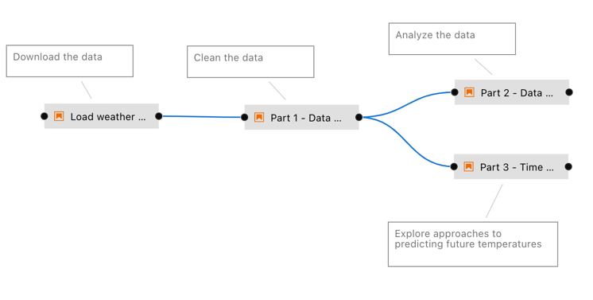
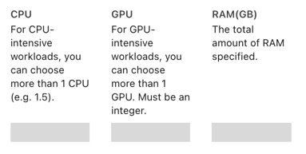
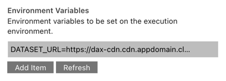

<!--

Copyright 2018-2023 Elyra Authors

Licensed under the Apache License, Version 2.0 (the "License");
you may not use this file except in compliance with the License.
You may obtain a copy of the License at

http://www.apache.org/licenses/LICENSE-2.0

Unless required by applicable law or agreed to in writing, software
distributed under the License is distributed on an "AS IS" BASIS,
WITHOUT WARRANTIES OR CONDITIONS OF ANY KIND, either express or implied.
See the License for the specific language governing permissions and
limitations under the License.

-->
## Run generic pipelines on Kubeflow Pipelines

A [pipeline](https://elyra.readthedocs.io/en/stable/user_guide/pipelines.html) comprises one or more nodes that are (in many cases) connected to define execution dependencies. Each node is implemented by a [component](https://elyra.readthedocs.io/en/stable/user_guide/pipeline-components.html) and typically performs only a single task, such as loading data, processing data, training a model, or sending an email.

A _generic pipeline_ comprises nodes that are implemented using _generic components_. In the current release Elyra includes generic components that run Jupyter notebooks, Python scripts, and R scripts. Generic components have in common that they are supported in every Elyra pipelines runtime environment: local/JupyterLab, Kubeflow Pipelines, and Apache Airflow.

The [_Introduction to generic pipelines_ tutorial](../introduction-to-generic-pipelines) outlines how to create a generic pipeline using the Visual Pipeline Editor.

In this intermediate tutorial you will learn how to run a generic pipeline on Kubeflow Pipelines, monitor pipeline execution using the Kubeflow Central Dashboard, and access the outputs.
在本中级教程中，您将学习如何在 Kubeflow Pipelines 上运行通用管道、使用 Kubeflow Central Dashboard 监控管道执行以及访问输出。

The tutorial instructions were last updated using Elyra v3.0 and Kubeflow v1.3.0.
本教程说明最后使用 Elyra v3.0 和 Kubeflow v1.3.0 进行更新。

### Prerequisites

- [JupyterLab 3.x with the Elyra extension v3.x (or newer) installed](https://elyra.readthedocs.io/en/stable/getting_started/installation.html).

- Access to a [local](https://elyra.readthedocs.io/en/stable/recipes/deploying-kubeflow-locally-for-dev.html) or [cloud](https://www.kubeflow.org/docs/started/installing-kubeflow/) Kubeflow Pipelines deployment.

#### Information to collect before starting

Collect the following information for your Kubeflow Pipelines installation:

- API endpoint, e.g. `http://kubernetes-service.ibm.com/pipeline`

- Namespace, for a multi-user, auth-enabled Kubeflow installation, e.g. `mynamespace`

- Username, for a multi-user, auth-enabled Kubeflow installation, e.g. `jdoe`

- Password, for a multi-user, auth-enabled Kubeflow installation, e.g. `passw0rd`

- Workflow engine type, which should be `Argo` or `Tekton`. Contact your administrator if you are unsure which engine your deployment utilizes.

Elyra utilizes S3-compatible cloud storage to make data available to notebooks and scripts while they are executed. Any kind of cloud storage should work (e.g. IBM Cloud Object Storage or Minio) as long as it can be accessed from the machine where JupyterLab is running and from the Kubeflow Pipelines cluster. Collect the following information:
Elyra 利用与 S3 兼容的云存储，使数据在笔记本和脚本执行时可用。任何类型的云存储都应该可以工作（例如 IBM Cloud Object Storage 或 Minio），只要可以从运行 JupyterLab 的计算机和 Kubeflow Pipelines 集群进行访问即可。收集以下信息：

- S3 compatible object storage endpoint, e.g. `http://minio-service.kubernetes:9000`

- S3 object storage username, e.g. `minio`

- S3 object storage password, e.g. `minio123`

- S3 object storage bucket, e.g. `pipelines-artifacts`

### Setup

This tutorial uses the `run-generic-pipelines-on-kubeflow-pipelines` sample from the https://github.com/elyra-ai/examples GitHub repository.

1. Launch JupyterLab.

2. Open the _Git clone_ wizard (Git > Clone A Repository).

3. Enter `https://github.com/elyra-ai/examples.git` as _Clone URI_.

4. In the _File Browser_ navigate to `examples/pipelines/run-generic-pipelines-on-kubeflow-pipelines`.

   

   The cloned repository includes a set of Jupyter notebooks and a Python script that download a weather data set from an [open data directory called the Data Asset Exchange](https://developer.ibm.com/exchanges/data/all/jfk-weather-data/), cleanse the data, analyze the data, and perform time-series predictions. The repository also includes a pipeline named `hello-generic-world` that runs the files in the appropriate order.
   克隆的存储库包括一组 Jupyter 笔记本和一个 Python 脚本，它们从名为 Data Asset Exchange 的开放数据目录下载天气数据集、清理数据、分析数据并执行时间序列预测。该存储库还包括一个名为 hello-generic-world 的管道，它以适当的顺序运行文件。

You are ready to start the tutorial.

### Review the generic pipeline

1. Open the `hello-generic-world` pipeline file.

   

2. Right click generic node `Load weather data` and select _Open Properties_ to review its configuration.

   

   A generic node configuration identifies the runtime environment, input artifacts (file to be executed, file dependencies and environment variables), and output files.
   通用节点配置标识运行时环境、输入工件（要执行的文件、文件依赖项和环境变量）和输出文件。

   

   Each generic node is executed in a separate container, which is instantiated using the configured _runtime image_.
   每个通用节点都在单独的容器中执行，该容器使用配置的运行时映像进行实例化。

   

   All nodes in this tutorial pipeline are configured to utilize a pre-configured public container image that has Python and the `Pandas` package preinstalled. For your own pipelines you should always utilize custom-built container images that have the appropriate prerequisites installed. Refer to the [_runtime image configuration_ topic in the User Guide](https://elyra.readthedocs.io/en/stable/user_guide/runtime-image-conf.html) for more information.
   本教程管道中的所有节点都配置为利用预配置的公共容器映像，该映像预安装了 Python 和 Pandas 包。对于您自己的管道，您应该始终使用安装了适当先决条件的定制容器映像。有关详细信息，请参阅用户指南中的运行时映像配置主题。

   If the container requires a specific minimum amount of resources during execution, you can specify them. For example, to speed up model training, you might want to make GPUs available.
   如果容器在执行期间需要特定的最小资源量，您可以指定它们。例如，为了加速模型训练，您可能希望提供 GPU。

   

   > If no custom resource requirements are defined, the defaults in the Kubeflow Pipeline environment are used.
   > 如果未定义自定义资源要求，则使用 Kubeflow Pipeline 环境中的默认值。

   Containers in which the notebooks or scripts are executed don't share a file system. Elyra utilizes S3-compatible cloud storage to facilitate the transfer of files from the JupyterLab environment to the containers and between containers.
   执行笔记本或脚本的容器不共享文件系统。 Elyra 利用 S3 兼容的云存储来促进文件从 JupyterLab 环境到容器以及容器之间的传输。

   

   Therefore you must declare files that the notebook or script requires and declare files that are being produced. The node you are inspecting does not have any file input dependecies but it does produce an output file.
   因此，您必须声明笔记本或脚本所需的文件并声明正在生成的文件。您正在检查的节点没有任何文件输入依赖项，但它确实会生成输出文件。

   

   Notebooks and scripts can be parameterized using environment variables. The node you are looking at requires a variable that identifies the download location of a data file.
   笔记本和脚本可以使用环境变量进行参数化。您正在查看的节点需要一个变量来标识数据文件的下载位置。

   

   Refer to [_Best practices for file-based pipeline nodes_](https://elyra.readthedocs.io/en/stable/user_guide/best-practices-file-based-nodes.html) in the _User Guide_ to learn more about considerations for each configuration setting.
   请参阅用户指南中基于文件的管道节点的最佳实践，了解有关每个配置设置的注意事项的更多信息。

### Define a runtime environment configuration

A [runtime configuration](https://elyra.readthedocs.io/en/stable/user_guide/runtime-conf.html) in Elyra contains connectivity information for a Kubeflow Pipelines instance and S3-compatible cloud storage. In this tutorial you will use the GUI to define the configuration, but you can also use the CLI.
Elyra 中的运行时配置包含 Kubeflow Pipelines 实例和 S3 兼容云存储的连接信息。在本教程中，您将使用 GUI 来定义配置，但也可以使用 CLI。

1. From the pipeline editor tool bar (or the JupyterLab sidebar on the left side) choose _Runtimes_ to open the runtime management panel.
   从管道编辑器工具栏（或左侧的 JupyterLab 侧栏）中选择“运行时”以打开运行时管理面板。

   

2. Click **+** and _New Kubeflow Pipelines runtime_ to create a new configuration for your Kubeflow Pipelines deployment.
   单击 + 和新建 Kubeflow Pipelines 运行时，为您的 Kubeflow Pipelines 部署创建新配置。

3. Enter a _name_ and a _description_ for the configuration and optionally assign _tags_ to support searching.

   

4. Enter the connectivity information for your Kubeflows Pipelines deployment:
   输入 Kubeflows Pipelines 部署的连接信息：

   - _Kubeflow Pipelines API endpoint_, e.g. `https://kubernetes-service.ibm.com/pipeline`

     > Do not specify the namespace in the API endpoint.
     > 不要在 API 端点中指定命名空间。

   - _User namespace_ used to run pipelines, e.g. `mynamespace`

   - User credentials if the deployment is multi-user, auth enabled using Dex.

   - Workflow _engine_ type, which is either `Argo` (default) or `Tekton`. Check with an administrator if you are unsure which workflow engine your deployment utilizes.

   

   Refer to the [runtime configuration documentation](https://elyra.readthedocs.io/en/stable/user_guide/runtime-conf.html#configuration-settings) for a description of each input field.

5. Enter the connectivity information for your  S3-compatible cloud storage:
   输入兼容 S3 的云存储的连接信息：

   - The _cloud object storage endpoint_ URL, e.g. `https://minio-service.kubeflow:9000`

   - _Username_, e.g. `minio`

   - _Password_, e.g. `minio123`

   - _Bucket name_, where Elyra will store the pipeline input and output artifacts, e.g. `test-bucket`

   

   > Refer to [this topic](https://elyra.readthedocs.io/en/stable/user_guide/runtime-conf.html#cloud-object-storage-credentials-secret-cos-secret) for important information about the optional credentials secret.

6. Save the runtime configuration.

7. Expand the twistie in front of the configuration entry.

   

   The displayed links provide access to the configured Kubeflow Pipelines Central Dashboard and the cloud storage UI (if one is available at the specified URL). Open the links to confirm connectivity.
   显示的链接提供对已配置的 Kubeflow Pipelines Central Dashboard 和云存储 UI 的访问（如果在指定的 URL 上可用）。打开链接以确认连接。

   > If you are accessing the Kubeflow Pipelines Dashboard for the first time an error might be raised (e.g. "`Failed to retrieve list of pipelines`") if namespaces are configured. To resolve this issue, manually open the Kubeflow Pipelines Central Dashboard (e.g. `https://kubernetes-service.ibm.com/` instead of `https://kubernetes-service.ibm.com/pipeline`) and select a namespace, and then try opening the link again.
   > 如果您是第一次访问 Kubeflow Pipelines 仪表板，并且配置了命名空间，则可能会引发错误（例如“ Failed to retrieve list of pipelines ”）。要解决此问题，请手动打开 Kubeflow Pipelines Central Dashboard（例如 https://kubernetes-service.ibm.com/ 而不是 https://kubernetes-service.ibm.com/pipeline ）并选择一个命名空间，然后尝试再次打开链接。

### Run a generic pipeline on Kubeflow Pipelines

You can run pipelines from the Visual Pipeline Editor or using the [`elyra-pipeline` command line interface](https://elyra.readthedocs.io/en/stable/user_guide/pipelines.html#running-a-pipeline-using-the-command-line).
您可以从可视化管道编辑器或使用 elyra-pipeline 命令行界面运行管道。

1. Open the run wizard.

   

2. The _Pipeline Name_ is pre-populated with the pipeline file name. The specified name is used to name the pipeline and experiment in Kubeflow Pipelines.
   管道名称已预先填充管道文件名。指定的名称用于命名 Kubeflow Pipelines 中的管道和实验。

3. Select `Kubeflow Pipelines` as _Runtime platform_.
   选择 Kubeflow Pipelines 作为运行时平台。

   

4. From the _Runtime configuration_ drop down select the runtime configuration you just created.
   从运行时配置下拉列表中选择您刚刚创建的运行时配置。

5. Start the pipeline run. The pipeline artifacts (notebooks, Python scripts and file input dependencies) are gathered, packaged, and uploaded to cloud storage. The pipeline is compiled, uploaded to Kubeflow Pipelines, and executed in an experiment.
   开始管道运行。管道工件（笔记本、Python 脚本和文件输入依赖项）被收集、打包并上传到云存储。该管道经过编译、上传到 Kubeflow Pipelines 并在实验中执行。

   > Elyra automatically creates a Kubeflow Pipelines experiment using the pipeline name. For example, if you named the pipeline `hello-generic-world`, Elyra creates an experiment named `hello-generic-world`.
   > Elyra 使用管道名称自动创建 Kubeflow Pipelines 实验。例如，如果您将管道命名为 hello-generic-world ，Elyra 会创建一个名为 hello-generic-world 的实验。

   Each time you run a pipeline with the same name, it is uploaded as a new version, allowing for comparison between pipeline runs.
   每次运行同名的管道时，它都会作为新版本上传，以便在管道运行之间进行比较。

   

   The confirmation message contains two links:
   确认消息包含两个链接：

    - _Run details_: provides access to the Kubeflow Pipelines UI where you monitor the pipeline execution progress.
      运行详细信息：提供对 Kubeflow Pipelines UI 的访问，您可以在其中监控管道执行进度。

    - _Object storage_: provides access to the cloud storage where you access the input artifacts and output artifacts. (This link might not work if the configured cloud storage does not have a GUI interface or if the URL is different from the endpoint URL you've configured.)
      对象存储：提供对云存储的访问，您可以在其中访问输入工件和输出工件。 （如果配置的云存储没有 GUI 界面或者 URL 与您配置的端点 URL 不同，则此链接可能不起作用。）

### Monitor the pipeline run

Elyra does not provide a monitoring interface for Kubeflow Pipelines. However, it does provide a link to the Kubeflow Central Dashboard's pipeline runs panel.
Elyra 不提供 Kubeflow Pipelines 的监控接口。但是，它确实提供了指向 Kubeflow Central Dashboard 的管道运行面板的链接。

1. Open the _Run Details_ link. The _runs_ panel is displayed, depicting the in-progress execution graph for the pipeline. Only nodes that are currently executing or have already executed are displayed. Note that the run name is derived from the pipeline name and a timestamp, e.g. `hello-generic-world-0716111722`.
   打开运行详细信息链接。将显示运行面板，描绘管道的正在进行的执行图。仅显示当前正在执行或已经执行的节点。请注意，运行名称源自管道名称和时间戳，例如 hello-generic-world-0716111722 。

   

2. Select the first node. A side panel opens, displaying information about the node.

3. Open the _Logs_ tab to access the node's execution log file.

   

   Output that notebooks or scripts produce is captured by Elyra and automatically uploaded to the cloud storage bucket you've specified in the runtime configuration.
   笔记本或脚本生成的输出由 Elyra 捕获并自动上传到您在运行时配置中指定的云存储桶。

   If desired, you can visualize results directly in the Kubeflow Pipelines UI. For example, if a notebook trains a classification model, you could visualize its accuracy using a confusion matrix by producing metadata in Kubeflow Pipelines output viewer compatible format.
   如果需要，您可以直接在 Kubeflow Pipelines UI 中可视化结果。例如，如果笔记本训练分类模型，您可以通过以 Kubeflow Pipelines 输出查看器兼容格式生成元数据，使用混淆矩阵可视化其准确性。

4. Wait until node processing has completed before continuing.

5. Open the _Visualizations_ tab. For illustrative purposes the first node that runs the `load_data` notebook produces metadata in markdown format, which identifies the data set download location.

   

   > The code that produces the metadata is located in the notebook's last code cell.

   Refer to [_Visualizing output from your notebooks or Python scripts in the Kubeflow Pipelines UI_](https://elyra.readthedocs.io/en/stable/recipes/visualizing-output-in-the-kfp-ui.html) to learn more about adding visualizations.

6. Wait for the pipeline run to finish.

   

### Access the pipeline run outputs

Pipelines that execute on Kubeflow Pipelines store the pipeline run outputs (completed notebooks, script output, and declared output files) in the cloud storage bucket you've configured in the runtime configuration.
在 Kubeflow Pipelines 上执行的管道将管道运行输出（已完成的笔记本、脚本输出和声明的输出文件）存储在您在运行时配置中配置的云存储桶中。

1. Open the object storage link and, if required, log in.

2. Navigate to the bucket that you've specified in the runtime configuration to review the content. Note that the bucket contains a "directory" with the pipeline's Kubeflow run name, e.g. `hello-generic-world-0716111722`.

   

   The bucket contains for each node the following artifacts:
   该存储桶包含每个节点的以下工件：

      - a `tar.gz` archive containing the original notebook or script and, if applicable, its declared file dependencies
        包含原始笔记本或脚本及其声明的文件依赖项（如果适用）的 tar.gz 存档

      - if the node is associated with a notebook, the artifacts include the completed notebook with it's populated output cells and an HTML version of the completed notebook
        如果节点与笔记本关联，则工件包括已完成的笔记本及其填充的输出单元以及已完成笔记本的 HTML 版本

      - if the node is associated with a script, the artifacts include the console output that the script produced
        如果节点与脚本关联，则工件包括脚本生成的控制台输出

      - if applicable, the declared output files
        如果适用，声明的输出文件

   For example, for the `load_data` notebook the following artifacts should be present:

   - `load_data-<UUID>.tar.gz` (input artifacts)

   - `load_data.ipynb` (output artifact)

   - `load_data.html` (output artifact)

   - `data/noaa-weather-data-jfk-airport/jfk_weather.csv` (output artifact)

3. Download the output artifacts to your local machine and inspect them.

## Export the pipeline to a Kubeflow Pipelines Static Configuration File

When you run a pipeline from the pipeline editor, Elyra compiles the pipeline, uploads the compiled pipeline, creates an experiment, and runs the experiment. If you want to run the pipeline at a later time outside of Elyra, you can export it.
当您从管道编辑器运行管道时，Elyra 会编译管道、上传已编译的管道、创建实验并运行实验。如果您想稍后在 Elyra 之外运行管道，可以将其导出。

1. Open the pipeline in the Pipeline Editor.

2. Click the _Export Pipeline_ button.

   

3. Select _Kubeflow Pipelines_ as the runtime platform, then select the runtime configuration you've created. Export the pipeline.
   选择 Kubeflow Pipelines 作为运行时平台，然后选择您创建的运行时配置。导出管道。

   

   > An exported pipeline comprises of two parts: the pipeline definition and the input artifact archives that were uploaded to cloud storage.
   > 导出的管道由两部分组成：管道定义和上传到云存储的输入工件档案。

   > In order to run the exported pipeline, the generated YAML-formatted static configuration file must be manually uploaded using the Kubeflow Pipelines Dashboard. Elyra compiles the pipeline for the engine (`Argo` or `Tekton`) that you've defined in the runtime configuration.
   > 为了运行导出的管道，必须使用 Kubeflow Pipelines Dashboard 手动上传生成的 YAML 格式的静态配置文件。 Elyra 编译您在运行时配置中定义的引擎（ Argo 或 Tekton ）的管道。

4. Locate the generated `hello-generic-world.yaml` configuration file in the _File Browser_.

5. Open the exported file and briefly review the content.

   

    Note the references to the artifacts archives and the embedded cloud storage connectivity information. (Not shown in the screen capture above). If you've preconfigured a Kubernetes secret and specified its name in the runtime configuration, only the secret name is stored in the exported files.
    请注意对工件档案和嵌入式云存储连接信息的引用。 （上面的屏幕截图中未显示）。如果您已预先配置 Kubernetes 密钥并在运行时配置中指定其名称，则仅密钥名称会存储在导出的文件中。

### Next steps

This concludes the _Run generic pipelines on Kubeflow Pipelines_ tutorial. You've learned how to

- create a Kubeflow Pipelines runtime configuration

- run a pipeline on Kubeflow Pipelines

- monitor the pipeline run progress in the Kubeflow Pipelines Central Dashboard

- review output visualizations a notebook or script produces

- access the pipeline run output on cloud storage

- export a pipeline to a Kubeflow Pipelines native format

### Resources

- [_Pipelines_ topic in the Elyra _User Guide_](https://elyra.readthedocs.io/en/stable/user_guide/pipelines.html)
- [_Pipeline components_ topic in the Elyra _User Guide_](https://elyra.readthedocs.io/en/stable/user_guide/pipeline-components.html)
- [_Best practices for file-based pipeline nodes_ topic in the Elyra _User Guide_](https://elyra.readthedocs.io/en/stable/user_guide/best-practices-file-based-nodes.html)
- [_Runtime configuration_ topic in the Elyra _User Guide_](https://elyra.readthedocs.io/en/stable/user_guide/runtime-conf.html)
- [_Runtime image configuration_ topic in the Elyra _User Guide_](https://elyra.readthedocs.io/en/stable/user_guide/runtime-image-conf.html)
- [_Command line interface_ topic in the Elyra _User Guide_](https://elyra.readthedocs.io/en/stable/user_guide/command-line-interface.html)
