<!--

Copyright 2018-2023 Elyra Authors

Licensed under the Apache License, Version 2.0 (the "License");
you may not use this file except in compliance with the License.
You may obtain a copy of the License at

http://www.apache.org/licenses/LICENSE-2.0

Unless required by applicable law or agreed to in writing, software
distributed under the License is distributed on an "AS IS" BASIS,
WITHOUT WARRANTIES OR CONDITIONS OF ANY KIND, either express or implied.
See the License for the specific language governing permissions and
limitations under the License.

-->
## Run pipelines on Kubeflow Pipelines
在 Kubeflow Pipelines 上运行管道

A [pipeline](https://elyra.readthedocs.io/en/stable/user_guide/pipelines.html) comprises one or more nodes that are (in many cases) connected to define execution dependencies. Each node is implemented by a [component](https://elyra.readthedocs.io/en/stable/user_guide/pipeline-components.html) and typically performs only a single task, such as loading data, processing data, training a model, or sending an email.
管道由一个或多个节点组成，这些节点（在许多情况下）连接起来以定义执行依赖性。每个节点由一个组件实现，通常仅执行一项任务，例如加载数据、处理数据、训练模型或发送电子邮件。

A _generic pipeline_ comprises nodes that are implemented using _generic components_. Elyra includes generic components that run Jupyter notebooks, Python scripts, and R scripts. Generic components have in common that they are supported in every Elyra pipelines runtime environment: local/JupyterLab, Kubeflow Pipelines, and Apache Airflow.
通用管道包含使用通用组件实现的节点。 Elyra 包括运行 Jupyter 笔记本、Python 脚本和 R 脚本的通用组件。通用组件的共同点是它们在每个 Elyra pipelines 运行时环境中都受支持：local/JupyterLab、Kubeflow Pipelines 和 Apache Airflow。

The following tutorials cover generic pipelines:
- [Introduction to generic pipelines](../introduction-to-generic-pipelines)
- [Run generic pipelines on Kubeflow Pipelines](../run-generic-pipelines-on-kubeflow-pipelines)
- [Run generic pipelines on Apache Airflow](../run-generic-pipelines-on-apache-airflow)

A _runtime specific_ pipeline comprises nodes that are implemented using generic components or _custom components_. Custom components are runtime specific and user-provided.
运行时特定管道包含使用通用组件或自定义组件实现的节点。自定义组件是运行时特定的并且由用户提供。

In this intermediate tutorial you will learn how to add [Kubeflow Pipelines components](https://www.kubeflow.org/docs/components/pipelines/sdk/component-development/) to Elyra and how to utilize them in pipelines.
在本中级教程中，您将学习如何将 Kubeflow Pipelines 组件添加到 Elyra 以及如何在管道中使用它们。

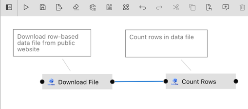

The features described in this tutorial require Elyra v3.3 or later. The tutorial instructions were last updated using Elyra v3.3.0 and Kubeflow v1.4.1.
本教程中描述的功能需要 Elyra v3.3 或更高版本。本教程说明最后使用 Elyra v3.3.0 和 Kubeflow v1.4.1 进行更新。

> Elyra does not support [Kubeflow Pipelines Python function-based components](https://www.kubeflow.org/docs/components/pipelines/sdk/python-function-components/).
> Elyra 不支持 Kubeflow Pipelines 基于 Python 函数的组件。

### Prerequisites

- [JupyterLab 3.x with the Elyra extension v3.3 (or later) installed](https://elyra.readthedocs.io/en/stable/getting_started/installation.html).
  安装了 Elyra 扩展 v3.3（或更高版本）的 JupyterLab 3.x。

- Access to a [local](https://elyra.readthedocs.io/en/stable/recipes/deploying-kubeflow-locally-for-dev.html) or [cloud](https://www.kubeflow.org/docs/started/installing-kubeflow/) Kubeflow Pipelines deployment.
  访问本地或云 Kubeflow Pipelines 部署。

Some familiarity with Kubeflow Pipelines and Kubeflow Pipelines components is required to complete the tutorial. If you are new to Elyra, please review the [_Run generic pipelines on Kubeflow Pipelines_](../run-generic-pipelines-on-kubeflow-pipelines) tutorial. It introduces concepts and tasks that are used in this tutorial, but not explained here to avoid content duplication.
完成本教程需要熟悉 Kubeflow Pipelines 和 Kubeflow Pipelines 组件。如果您是 Elyra 新手，请查看在 Kubeflow Pipelines 上运行通用管道教程。它介绍了本教程中使用的概念和任务，但此处未进行解释，以避免内容重复

#### Information to collect before starting

Collect the following information for your Kubeflow Pipelines installation:

- API endpoint, e.g. `http://kubernetes-service.ibm.com/pipeline`

- Namespace, for a multi-user, auth-enabled Kubeflow installation, e.g. `mynamespace`

- Username, for a multi-user, auth-enabled Kubeflow installation, e.g. `jdoe`

- Password, for a multi-user, auth-enabled Kubeflow installation, e.g. `passw0rd`

- Workflow engine type, which should be `Argo` or `Tekton`. Contact your administrator if you are unsure which engine your deployment utilizes.

Elyra utilizes S3-compatible cloud storage to make data available to notebooks and scripts while they are executed. Any kind of S3-based cloud storage should work (e.g. IBM Cloud Object Storage or Minio) as long as it can be accessed from the machine where JupyterLab/Elyra is running and from the Kubeflow Pipelines cluster.
Elyra 利用与 S3 兼容的云存储，使数据在笔记本和脚本执行时可用。任何类型的基于 S3 的云存储都应该可以工作（例如 IBM Cloud Object Storage 或 Minio），只要可以从运行 JupyterLab/Elyra 的计算机和 Kubeflow Pipelines 集群进行访问即可。

Collect the following information:

- S3 compatible object storage endpoint, e.g. `http://minio-service.kubernetes:9000`

- S3 object storage username, e.g. `minio`

- S3 object storage password, e.g. `minio123`

- S3 object storage bucket, e.g. `pipelines-artifacts`

### Tutorial setup

#### Create a runtime configuration

Create a runtime environment configuration for your Kubeflow Pipelines installation as described in [_Runtime configuration_ topic in the User Guide](https://elyra.readthedocs.io/en/stable/user_guide/runtime-conf.html) or the [_Run generic pipelines on Kubeflow Pipelines_ tutorial](https://github.com/elyra-ai/examples/tree/main/pipelines/run-generic-pipelines-on-kubeflow-pipelines#define-a-runtime-environment-configuration).
按照用户指南中的运行时配置主题或在 Kubeflow Pipelines 教程中运行通用管道中所述，为 Kubeflow Pipelines 安装创建运行时环境配置。

#### Clone the tutorial artifacts

This tutorial uses the `run-pipelines-on-kubeflow-pipelines` sample from the https://github.com/elyra-ai/examples GitHub repository.

1. Launch JupyterLab.

2. Open the _Git clone_ wizard (Git > Clone A Repository).

3. Enter `https://github.com/elyra-ai/examples.git` as _Clone URI_.

4. In the _File Browser_ navigate to `examples/pipelines/run-pipelines-on-kubeflow-pipelines`.

   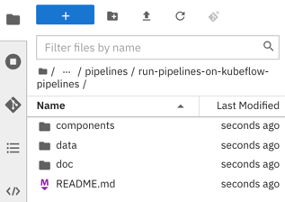

   The cloned repository includes a set of custom component specifications that you will add to the Elyra component catalog and use in a pipeline. The '`Download File`' component downloads a file from a web resource. The '`Count Rows`' component counts the lines in a row-based file.
   克隆的存储库包含一组自定义组件规范，您将添加到 Elyra 组件目录并在管道中使用。 “ Download File ”组件从 Web 资源下载文件。 ' Count Rows '组件计算基于行的文件中的行数。

You are ready to start the tutorial.

### Add custom components via component catalog
通过组件目录添加自定义组件

Elyra stores information about custom components in [component catalogs](https://elyra.readthedocs.io/en/stable/user_guide/pipeline-components.html#component-catalogs) and makes those components available in the Visual Pipeline Editor's palette. Components can be grouped into categories to make them more easily discoverable.
Elyra 将有关自定义组件的信息存储在组件目录中，并使这些组件在可视化管道编辑器的调色板中可用。可以将组件分为几类，以便更容易发现它们。

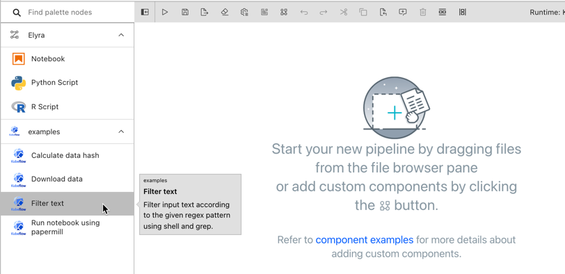

Custom components are [managed in the JupyterLab UI](https://elyra.readthedocs.io/en/stable/user_guide/pipeline-components.html#managing-pipeline-components) using the **Pipeline components** panel. You access the panel by:
使用 Pipeline 组件面板在 JupyterLab UI 中管理自定义组件。您可以通过以下方式访问该面板：

   - Selecting `Pipeline Components` from the JupyterLab sidebar.
     从 JupyterLab 侧栏中选择 Pipeline Components。

   - Clicking the `Open Pipeline Components` button in the pipeline editor toolbar.
     单击管道编辑器工具栏中的 Open Pipeline Components 按钮。

   - Searching for `Manage pipeline components` in the [JupyterLab command palette](https://jupyterlab.readthedocs.io/en/stable/user/commands.html).
     在 JupyterLab 命令面板中搜索 Manage pipeline components 。

> You can automate the component management tasks using the [`elyra-metadata install component-catalogs` CLI command](https://elyra.readthedocs.io/en/stable/user_guide/pipeline-components.html#managing-custom-components-using-the-elyra-cli).
> 您可以使用 elyra-metadata install component-catalogs CLI 命令自动执行组件管理任务。

The component catalog can access component specifications that are stored in the local file system or on remote sources. In this tutorial, 'local' refers to the file system where JupyterLab/Elyra is running. For example, if you've installed Elyra on your laptop, 'local' refers to the laptop's file system. If you've installed Elyra in a container image, 'local' refers to the container's file system.
组件目录可以访问存储在本地文件系统或远程源中的组件规范。在本教程中，“本地”是指运行 JupyterLab/Elyra 的文件系统。例如，如果您在笔记本电脑上安装了 Elyra，则“本地”指的是笔记本电脑的文件系统。如果您已在容器映像中安装 Elyra，则“本地”是指容器的文件系统。

#### Add components from the local file system

Use locally stored component specifications if there is no (immediate) need to share the specification with other users, for example, during initial development and prototyping.
如果没有（立即）需要与其他用户共享规范，请使用本地存储的组件规范，例如在初始开发和原型设计期间。

1. Open the **Pipeline components** panel using one of the approaches mentioned above.

   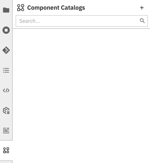

   Note that the palette may already [include a few example components](https://github.com/elyra-ai/examples/tree/main/component-catalog-connectors/kfp-example-components-connector), depending on how you installed Elyra. These examples are included for illustrative purposes to help you get started but you won't use them in this tutorial.
   请注意，调色板可能已经包含一些示例组件，具体取决于您安装 Elyra 的方式。包含这些示例是为了说明目的，以帮助您入门，但您不会在本教程中使用它们。

2. Add a new component catalog entry by clicking `+` and `New Filesystem Component Catalog`.
   The first tutorial component you are adding counts the number of rows in a file.

3. Enter or select the following:

   - **Name**: `analyze data`

   - **Description**: `analyze row based data`

   - **Runtime Type**: `KUBEFLOW_PIPELINES`

   - **Category**: `analyze`

   - **Base Directory**: `.../examples/pipelines/run-pipelines-on-kubeflow-pipelines/components` (on Windows: `...\examples\pipelines\run-pipelines-on-kubeflow-pipelines\components`)

     > Note: Replace `...` with the path to the location where you cloned the Elyra example repository. The base directory can include `~` or `~user` to indicate the home directory. The concatenation of the base directory and each path must resolve to an absolute path or Elyra won't be able to locate the specified files.
     > 注意：将 ... 替换为克隆 Elyra 示例存储库的位置的路径。基本目录可以包含 ~ 或 ~user 来指示主目录。基本目录和每个路径的串联必须解析为绝对路径，否则 Elyra 将无法找到指定的文件。

   - **Paths**: `count-rows.yaml`

4. Save the component catalog entry.

There are two approaches you can take to add multiple related component specifications:
您可以采用两种方法来添加多个相关的组件规范：

- Specify multiple **Path** values.

- Store the related specifications in the same directory and use the `Directory` **catalog type**. Elyra searches the directory for specifications. Check the **Include Subdirectories** checkbox to search subdirectories for component specifications as well.
  将相关规范存储在同一目录中，并使用 Directory 目录类型。 Elyra 在目录中搜索规格。选中“包括子目录”复选框也可以在子目录中搜索组件规范。

> Refer to the descriptions in the linked documentation topic for details and examples.

Locally stored component specifications have the advantage that they can be quickly loaded by Elyra. If you need to share component specifications with other users, ensure that the given **Paths** are the same relative paths across installations. The **Base Directory** can differ across installations.
本地存储的组件规范的优点是可以被 Elyra 快速加载。如果您需要与其他用户共享组件规范，请确保给定的路径在安装过程中是相同的相对路径。基本目录在不同的安装中可能有所不同。

#### Add components from web sources

The `URL Component Catalog` type only supports web resources that can be downloaded using HTTP `GET` requests, which don't require authentication.
URL Component Catalog 类型仅支持可使用 HTTP GET 请求下载的 Web 资源，无需身份验证。

To add component specifications to the catalog that are stored on the web:

1. Open the **Pipeline components** panel.

2. Add a new component catalog entry by clicking `+` and `New URL Component Catalog`.

3. Enter the following information:

   - **Name**: `download data`

   - **Description**: `download data from public sources`

   - **Runtime**: `KUBEFLOW_PIPELINES`

   - **Category Names**: `download`

   - **URLs**: `https://raw.githubusercontent.com/elyra-ai/examples/main/pipelines/run-pipelines-on-kubeflow-pipelines/components/download-file.yaml`

4. Save the component catalog entry.

The catalog is now populated with the custom components you'll use in the tutorial pipeline.

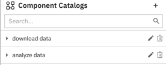

Next, you'll create a pipeline that uses the registered components.

### Create a pipeline

The pipeline editor's palette is populated from the component catalog. To use the components in a pipeline:

1. Open the JupyterLab Launcher.

2. Click the `Kubeflow Pipeline Editor` tile to open the Visual Pipeline Editor for Kubeflow Pipelines.

3. Expand the palette panel. Two new component categories are displayed (`analyze` and `download`), each containing one component entry that you added:
   展开调色板面板。将显示两个新的组件类别（ analyze 和 download ），每个类别都包含您添加的一个组件条目：

   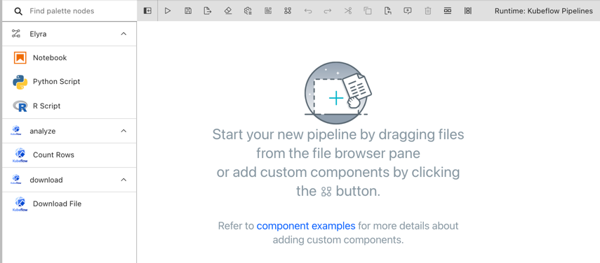

4. Drag the '`Download File`' component onto the canvas to create the first pipeline node.

5. Drag the '`Count Rows`' component onto the canvas to create a second node and connect the two nodes as shown.

   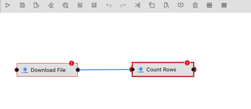

   Note that each node is tagged with an error icon. Hover over each node and review the error messages. The components require inputs, which you need to specify to render the nodes functional.
   请注意，每个节点都标有错误图标。将鼠标悬停在每个节点上并查看错误消息。这些组件需要输入，您需要指定这些输入才能使节点发挥作用。

6. Open the properties of the '`Download File`' node:

      - select the node and expand (&#8612;) the properties slideout panel on the right OR

      - right click on the node and select `Open Properties`

   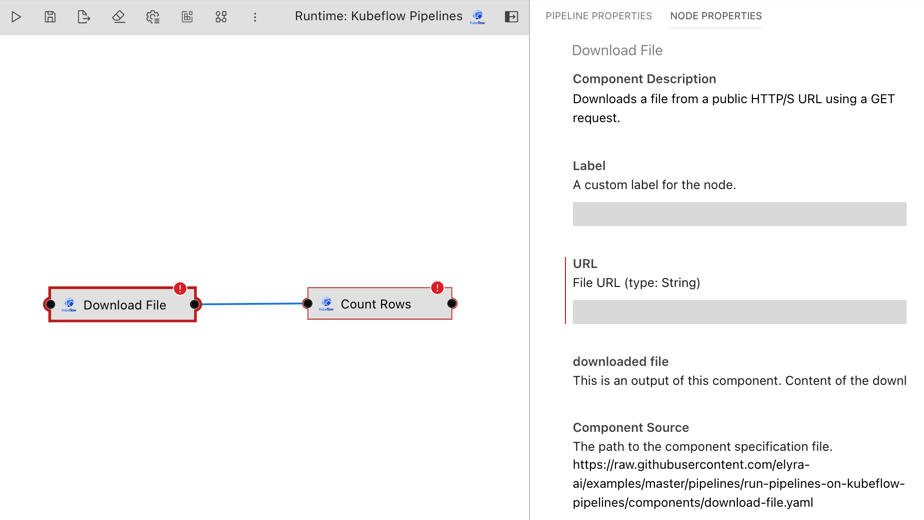

7. Review the node properties. The properties are a combination of Elyra metadata and information that was extracted from the [component's specification](https://raw.githubusercontent.com/elyra-ai/examples/main/pipelines/run-pipelines-on-kubeflow-pipelines/components/download-file.yaml):
   查看节点属性。这些属性是 Elyra 元数据和从组件规范中提取的信息的组合：

   ```
   name: Download File
   description: Downloads a file from a public HTTP/S URL using a GET request.

   inputs:
   - {name: URL, type: String, optional: false, description: 'File URL'}

   outputs:
   - {name: downloaded file, type: String, description: 'Content of the downloaded file.'}
   ...
   ```

   The component requires one input ('`URL`') and produces one output ('`downloaded file`'), which is the content of the downloaded file.
   该组件需要一个输入（“ URL ”）并生成一个输出（“ downloaded file ”），即下载文件的内容。

   The node properties include:

   - `Label` (Elyra property): If specified, the value is used as node name in the pipeline instead of the component name. Use labels to resolve naming conflicts that might arise if a pipeline uses the same component multiple times. For example, if a pipeline utilizes  the '`Download File`' component to download two files, you could override the node name by specifying '`Download labels`' and '`Download observations`' as labels:

      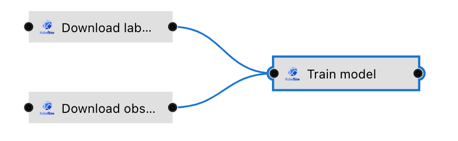

   - `URL`: This is a required input of the '`Download File`' component:

      ```
      inputs:
      - {name: URL, type: String, optional: false, description: 'File URL'}
      ```

      The pipeline editor renders component inputs using an editable widget, such as a text box, and, if one was provided, displays input's description. Since this property is marked in the specification as required, the pipeline editor enforces the constraint.

      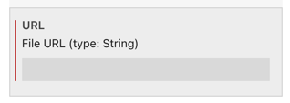

   - `downloaded file`: This is an output of the '`Download File`' component:

      ```
      outputs:
      - {name: downloaded file, type: String, description: 'Content of the downloaded file.'}
      ```

      The pipeline editor renders outputs using read-only widgets.

      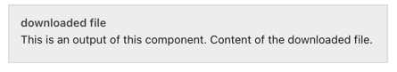

   - `Component source`: A read-only property that identifies the location from where the component specification was loaded. This property is displayed for informational purposes only.

8. Enter `https://raw.githubusercontent.com/elyra-ai/examples/main/pipelines/run-pipelines-on-kubeflow-pipelines/data/data.csv` as value for the `URL` input property.

   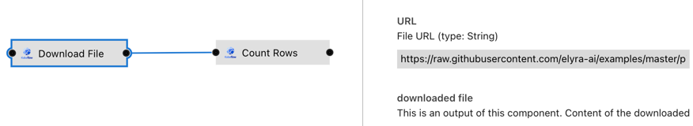

9.  Open the properties of the '`Count Rows`' node. The [specification for the underlying component looks as follows](https://raw.githubusercontent.com/elyra-ai/examples/main/pipelines/run-pipelines-on-kubeflow-pipelines/components/count-rows.yaml):

   ```
   name: Count Rows
   description: Count the number of rows in the input file

   inputs:
   - {name: input file, type: String, optional: false, description: 'Row-based file to be analyzed'}

   outputs:
   - {name: row count, type: String, description: 'Number of rows in the input file.'}
   ...
   implementation:
   ...
    command: [
      python3,
      /pipelines/component/src/count-rows.py,
      --input-file-path,
      {inputPath: input file},
   ...
   ```

   The component requires one input ('`input file`') and produces one output ('`row count`'), which is the number of rows in this file.

   Note that Kubeflow Pipelines passes the input to the implementing Python script as a file handle:

   ```
   --input-file-path,
      {inputPath: input file},
   ```

   The pipeline editor takes this as a cue and renders a selector widget for this input:

   

   Since the '`Count Rows`' node is only connected to one upstream node ('`Download File`'), you can only choose from the outputs of that node. (An upstream node is a node that is connected to and executed before the node in question.)

   If a node is connected to multiple upstream nodes, you can choose the output of any of these nodes as input, as shown in this example:

   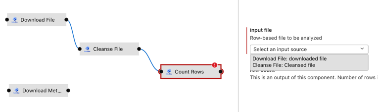

   The output of the second download node ('`Download Metadata`') cannot be consumed by the '`Count Rows`' node, because the two nodes are not connected in this pipeline.

   > Elyra intentionally only supports explicit dependencies between nodes to avoid potential usability issues.

10. Save the pipeline.

   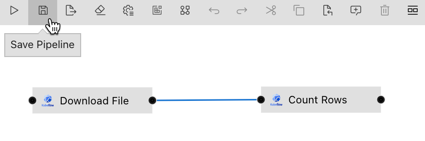

11. Rename the pipeline to something meaningful:
   - right click on the pipeline editor tab and select `Rename Pipeline...` OR
   - in the JupyterLab File Browser right click on the `.pipeline` file

   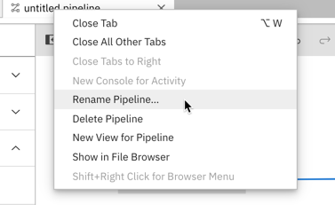

Next, you run the pipeline.

### Run the pipeline

To run the pipeline on Kubeflow Pipelines:

1. Click the `Run` button in the pipeline editor toolbar.

   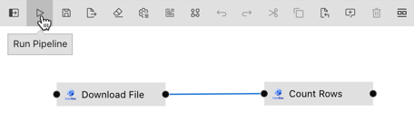

   > You can also use the `elyra-pipeline submit` command to [run the pipeline using the command line interface](https://elyra.readthedocs.io/en/stable/user_guide/command-line-interface.html#running-pipelines).

2. In the _run pipeline_ dialog select the runtime configuration you created [when you completed the setup for this tutorial](#create-a-runtime-configuration).

3. Start the pipeline run and monitor the execution progress in the Kubeflow Pipelines Central Dashboard.

   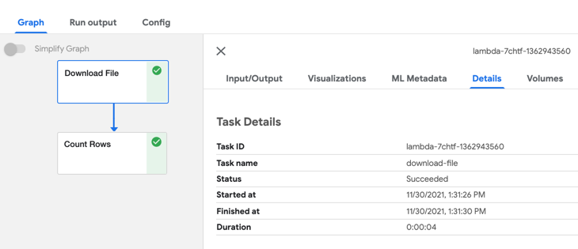

4. Review the outputs of each pipeline task. The output of the '`Count Rows`' node should indicate that the downloaded file contains five rows.

   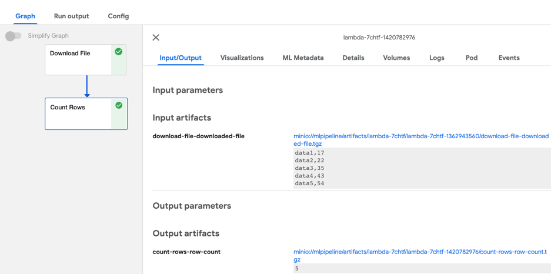

   > Elyra does not store custom component outputs in cloud storage. (It only does this for [generic pipeline components](https://elyra.readthedocs.io/en/stable/user_guide/pipeline-components.html#overview).) To access the output of custom components use the Kubeflow Central Dashboard.

### Next steps

This concludes the _Run pipelines on Kubeflow Pipelines_ tutorial. You've learned how to 
- add custom Kubeflow Pipelines components
- create a pipeline from custom components

### Resources

- [_Building Components_ topic in the Kubeflow Pipelines documentation](https://www.kubeflow.org/docs/components/pipelines/sdk/component-development/)
- [_Pipelines_ topic in the Elyra _User Guide_](https://elyra.readthedocs.io/en/stable/user_guide/pipelines.html)
- [_Pipeline components_ topic in the Elyra _User Guide_](https://elyra.readthedocs.io/en/stable/user_guide/pipeline-components.html)
- [_Requirements and best practices for custom pipeline components_ topic in the Elyra _User Guide_](https://elyra.readthedocs.io/en/stable/user_guide/best-practices-custom-pipeline-components.html)
- [Example component catalog connectors](https://github.com/elyra-ai/examples/tree/main/component-catalog-connectors)
- [Component catalog directory](https://github.com/elyra-ai/examples/blob/main/component-catalog-connectors/connector-directory.md)
- [_Command line interface_ topic in the Elyra _User Guide_](https://elyra.readthedocs.io/en/stable/user_guide/command-line-interface.html)
